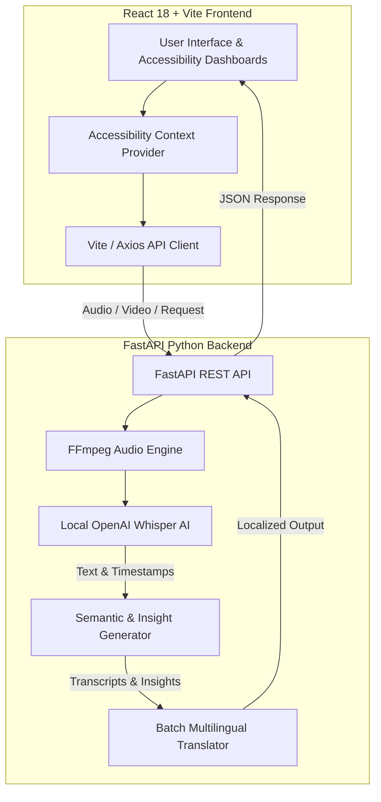

# 🎙️ MeetNote AI — Inclusive AI Meeting Assistant & Accessibility Platform

[](https://fastapi.tiangolo.com/)
[](https://react.dev/)
[](https://vitejs.dev/)
[](https://github.com/openai/whisper)
[](https://tailwindcss.com/)

**MeetNote AI** is an advanced, AI-powered meeting transcription, summarization, and accessibility platform designed to make meetings productive and inclusive for everyone. By combining local AI speech recognition, multilingual translation, semantic insights, and tailored neurodivergent and accessibility dashboards, MeetNote AI breaks down communication barriers for diverse teams.

---

## ✨ Key Features

### 🧠 1. AI Meeting Intelligence & Analytics
- **Local Speech Recognition**: Powered by OpenAI Whisper for fast, private, and high-accuracy transcription.
- **Speaker Diarization & Timeline**: Automatic speaker turn identification and word-level timestamps (`MM:SS`).
- **Smart Summarization**: Keyword frequency scoring algorithms to automatically extract top meeting key points.
- **Dynamic Mind Map Generation**: Visual interactive node graphs generated directly from meeting topics.
- **Semantic Extraction**:
  - 📋 **Action Items**: Automatically detects tasks, assignments, and follow-ups.
  - 💡 **Key Decisions**: Highlights locked decisions and approvals.
  - ❓ **Questions**: Tracks unresolved questions and queries raised during meetings.
  - ⚠️ **Risk Identification**: Detects blockers, delays, and critical concerns.
  - 🎭 **Sentiment Tracking**: Overall meeting sentiment score + segment-by-segment timeline sentiment breakdown.

### 🌐 2. Multilingual & Batch Translation
- Supports 12+ languages including **Hindi, Marathi, Gujarati, Bengali, Tamil, Telugu, Kannada, Malayalam, Punjabi, Spanish, French, German, and English**.
- High-performance batch translation pipeline for instantaneous rendering of transcripts, summaries, speaker turns, and mind maps.

### ♿ 3. Dedicated Neurodivergent & Accessibility Dashboards
MeetNote AI offers tailored UI modes designed specifically for diverse cognitive and visual needs:

- 🎯 **ADHD Dashboard**: Low-distraction layout, focus modes, chunked text displays, and interactive step-by-step task breakdowns.
- 📖 **Dyslexia Dashboard**: OpenDyslexic typography, expanded line spacing, high-contrast text, and integrated Text-to-Speech (TTS) reading assistant.
- 🎨 **Color-Blind Friendly Dashboard**: Accessible color palettes (deuteranopia / protanopia / tritanopia), high-contrast badges, and pattern-based visual cues.
- 🧏 **Hearing Impaired Dashboard**: AI Sign Language Avatar / visual interpretation canvas, real-time closed captions, sound alerts, and visual speaker indicators.

### 📹 4. Flexible Input Channels
- **Audio Upload**: Upload recorded audio files (`.wav`, `.mp3`, `.m4a`).
- **Video Upload**: Automated audio extraction and processing for video recordings (`.mp4`, etc.).
- **Live Meeting Mode**: Real-time speech recognition via microphone capture for live sessions.

---

## 🏗️ System Architecture



---

## 📁 Repository Structure

```
MeetNote-Ai/
├── backend/                  # FastAPI Python backend server
│   ├── app.py                # Core application entry
│   ├── main.py               # Main API endpoints, Whisper AI, & NLP engine
│   └── transcription.txt     # Sample transcription output reference
├── frontend/                 # React + Vite frontend application
│   ├── public/               # Static assets & icons
│   ├── src/
│   │   ├── assets/           # UI media & brand assets
│   │   ├── components/       # Reusable components (Navbar, Upload, MindMap, etc.)
│   │   │   ├── layout/       # Shell layouts, Sidebars, Navbars
│   │   │   ├── meeting/      # Sign language interpretation & analysis views
│   │   │   └── shared/       # Shared ResultTabs, SummaryPanel, MindMap
│   │   ├── context/          # Accessibility Context State Management
│   │   ├── data/             # Mock data & fallback datasets
│   │   ├── hooks/            # Custom React hooks (useTranscription)
│   │   ├── pages/            # Page routes & accessible dashboards
│   │   │   └── dashboards/   # ADHD, Dyslexia, ColorBlind, Hearing, Default
│   │   ├── services/         # API integration services
│   │   ├── App.jsx           # Application routing configuration
│   │   └── main.jsx          # React app DOM entry point
│   ├── package.json          # Frontend dependencies & scripts
│   ├── tailwind.config.js    # Tailwind styling rules
│   └── vite.config.js        # Vite bundler configuration
├── .gitignore                # Global Git ignore rules
└── README.md                 # Project documentation
```

---

## 🚀 Getting Started

### Prerequisites
- **Python**: `3.10+` installed
- **Node.js**: `18.0+` installed
- **FFmpeg**: System requirement for audio processing (automatically injected via Python `imageio-ffmpeg` or installed globally)

---

### 1. Backend Setup (FastAPI + Whisper)

1. Navigate to the `backend/` directory:
   ```bash
   cd backend
   ```

2. Create and activate a Python virtual environment:
   ```bash
   # Windows (PowerShell)
   python -m venv venv
   .\venv\Scripts\activate

   # macOS / Linux
   python3 -m venv venv
   source venv/bin/activate
   ```

3. Install required Python packages:
   ```bash
   pip install fastapi uvicorn openai-whisper imageio-ffmpeg deep-translator pydantic python-multipart
   ```

4. Start the backend server:
   ```bash
   uvicorn main:app --reload --host 127.0.0.1 --port 8000
   ```
   > The backend API will be available at `http://127.0.0.1:8000`

---

### 2. Frontend Setup (React + Vite)

1. Open a new terminal and navigate to the `frontend/` directory:
   ```bash
   cd frontend
   ```

2. Install Node.js dependencies:
   ```bash
   npm install
   ```

3. Start the Vite development server:
   ```bash
   npm run dev
   ```
   > Open your browser and navigate to `http://localhost:5173`

---

## 🔌 API Endpoints Summary

| Endpoint | Method | Description |
| :--- | :--- | :--- |
| `/` | `GET` | Health check endpoint returning backend status |
| `/transcribe/` | `POST` | Uploads audio/video file for Whisper transcription, diarization, translation, & semantic analysis |
| `/translate-text/` | `POST` | Translates raw text strings between supported target languages |

---

## 🤝 Contributing

Contributions are welcome! If you would like to improve accessibility features, add new language models, or enhance UI components:

1. Fork the Repository
2. Create your Feature Branch (`git checkout -b feature/AwesomeFeature`)
3. Commit your Changes (`git commit -m 'Add some AwesomeFeature'`)
4. Push to the Branch (`git push origin feature/AwesomeFeature`)
5. Open a Pull Request

---

## 📜 License

Distributed under the MIT License.

---

<p align="center">
  Created with ❤️ for accessibility and inclusive collaboration.
</p>
